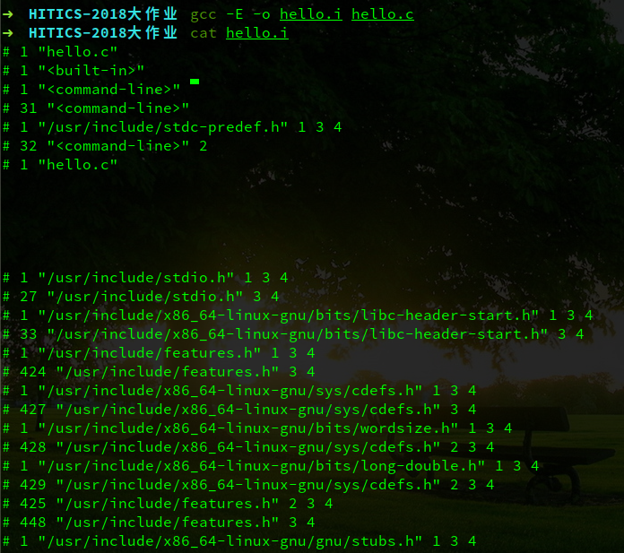

### <center>第二章 预处理</center>

#### 2.1 预处理的概念与作用

预处理是指在编译之前的预处理阶段，预处理程序对程序进行的操作，通常会生成一个.i后缀的预处理文件。

预处理的具体操作来自程序代码中的预编译命令。预处理命令主要有三个方面的内容：1. 宏定义 2. 文件包含 3. 条件编译，这些预处理命令在代码中以符号“#”开头。

预处理的主要作用仅仅是对程序代码文本进行替换操作，如将以#include格式包含的文件内容复制到编译的源文件中，用实际值替换#define定义的宏，以及根据#if的条件决定需要编译的代码。预处理过后程序代码中的预处理指令会被删除。所以预处理器的输出是原程序的一个编辑后的、不包含指令的版本。

#### 2.2 在Ubuntu下的预处理命令

预处理命令如下：

```powershell
gcc -E -o hello.i hello.c
```

执行效果：



#### 2.3 Hello的预处理结果解析

hello.i内容如下：

```
# 1 "hello.c"
# 1 "<built-in>"
# 1 "<command-line>"
# 31 "<command-line>"
# 1 "/usr/include/stdc-predef.h" 1 3 4
# 32 "<command-line>" 2
# 1 "hello.c"

……（8～3099行）

int sleepsecs=2.5;
	
int main(int argc,char *argv[])
{
 	 int i;
	
 	 if(argc!=3)
 	 {
  	  printf("Usage: Hello 学号 姓名！\n");
  	  exit(1);
 	 }
 	 for(i=0;i<10;i++)
 	 {
  	  printf("Hello %s %s\n",argv[1],argv[2]);
  	  sleep(sleepsecs);
 	 }
 	 getchar();
 	 return 0;
}

```

其中，由于hello源文件中有三条预处理命令：#include <stdio.h>、#include <unistd.h>、#include <stdlib.h>，预处理程序将三个文件中的内容拷贝到预处理文件中，即为以上1～3099行的内容，3100行到最后则是直接复制源文件的内容。如果遇到头文件中包含预处理命令，则递归地将内容复制进去，直到预处理文件中不包含任何预处理命令为止。

预处理文件中除了有正常的其余头文件内容外，还有一些类似下面的内容：

```
# 1 "/usr/include/stdc-predef.h" 1 3 4
```

这些内容都有一个固定的格式：

```
#linenum filename flag
```

表示一下内容是从\<filename>这个文件的第\<linenum>开始的，flag有一下几种情况：

1. 开始一个新文件 
2. 回到文件（递归返回）
3. 说明以下的内容是来自系统头文件
4. extern "C"。

如以上的例子表示：下面的内容是stdio.h文件第1行起的内容，以下内容是一个新文件(即stdio.h)的内容，系统头文件，extern C。

#### 2.4 本章小结

预处理是整个编译过程的第一步，事实上没有任何计算的过程的，仅仅是将一些用到的、涉及到的函数库头文件复制到程序源文件中、在程序代码中替换宏定义，并根据条件编译的条件保留相应的内容。该举措仅仅是为了简化之后的动作。有时，预处理动作也被包含在编译中。