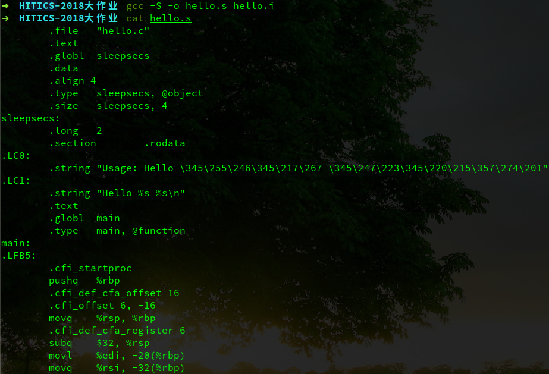

### <center>第三章 汇编</center>

#### 3.1 编译的概念与作用

编译，是指把ascii码形式的高级程序设计程序书写的源程序文件，翻译成等价的ascii码形式的汇编语言格式的文件。通常，源程序文件是一个经过预处理过后的.i文件。

编译除了基本的翻译操作，还包含语法检查和目标程序优化等功能。在翻译地过程中动态地检查语法错误，并将错误实时地反映出错误的类型和部位等有关信息。目标程序优化分为表达式优化、循环优化或程序全局优化，用以提高目标程序的质量,即占用的存储空间少,程序的运行时间短。

编译也仅仅是在文本方面的操作，并没有生成任何可执行的二进制代码。在编译过后，程序更加接近底层，方便进行下一步汇编的操作。

#### 3.2 在Ubuntu下编译的命令

编译命令：

```powershell
gcc -S -o hello.s hello.i
```

执行效果截图：



#### 3.3 Hello的编译结果解析

##### 3.3.1 常量

hello.c程序代码中出现了两种常量：字符串常量和数字常量，其中两个字符串常量：分别是"Usage: Hello 学号 姓名！\n"和"Hello %s %s\n"，这两个常量分别标记为.LC0和.LC1标签。调用时使用相对寻址，$rip加上标签的值即可找到对应的字符串。

```assembly
.LC0:
	.string	"Usage: Hello \345\255\246\345\217\267 \345\247\223\345\220\215\357\274\201"
.LC1:
	.string	"Hello %s %s\n"
```

四个数字常量分别是3、1、0、10和0，在汇编语句中以立即数的形式存储。如下：

```assembly
cmpl	$3, -20(%rbp)
movl	$1, %edi
movl	$0, -4(%rbp)
cmpl	$9, -4(%rbp)
movl	$0, %eax
```

其中，常量10作为循环结束条件的一部分，小于10被编译器修改成了小于等于9。

##### 3.3.2 变量

程序中出现了两个变量：分别是全局变量sleepsecs和局部变量i。

全局变量sleepsecs的声明在标签sleepsecs中，调用时用$rip加上标签的值即可找到该变量。以下语句表明sleepsecs是一个长整型数据，值为2。在.data标签下可以找到“.size	sleepsecs, 4”语句，表示sleepsecs占4个字节。

```assembly
sleepsecs:
	.long	2
```

局部变量i没有特殊声明，使用时仅仅是使用-4(%rbp)这个栈上的空间来保存一下i的内容。如下：

```assembly
movl	$0, -4(%rbp)
addl	$1, -4(%rbp)
cmpl	$9, -4(%rbp)
```

##### 3.3.3 表达式

程序中共出现五个表达式：两个布尔表达式和三个算数表达式。

布尔表达式argc!=3是if的条件，在该表达式为真的情况下流程进入if的方法体中，即在argc不等于3时执行if方法体。编译器对它进行了修改，变成了argc等于3时执行跳转，否则顺序执行。如下：

```assembly
cmpl	$3, -20(%rbp)
je	.L2
```

布尔表达式i<10是for循环的执行条件，只有在表达式为真的情况下才会执行该循环。编译器对它进行了修改，改为如果i<=9时执行循环。如下：

```assembly
sleepsecs:
	.long	2
```

运算式i=0是for循环的初始条件，表明执行循环之前先将i赋为0，实际的操作仅是将立即数0移到一个内存中。如下：

```assembly
movl	$0, -4(%rbp)
```

运算式i++是for循环的末尾循环体，在每次循环结束的时候执行。“++”是一个单目运算符，表示i自增1。如下：

```assembly
addl	$1, -4(%rbp)
```

##### 3.3.4 类型转换

hello中出现过一次隐式类型转换。在给sleepsecs赋初值的时候，由于sleepsecs是整型数据，而2.5是浮点型数据，导致精度损失，向下取整，sleepsecs的初值变为2。编译器直接将sleepsecs的值赋为2。如下：

```assembly
sleepsecs:
	.long	2
```

##### 3.3.5 控制转移

程序中出现两处控制转移，分别是if语句和for循环语句。

if语句原本条件是argc!=3，条件成立则执行条件内容。编译器将其修改为“如果argc==3则跳转”，循环体内容位于cmpl和je语句下方，而原本的if语句之外的内容则位于.L2标签内，je语句跳转至.L2标签。如下：

```assembly
cmpl	$3, -20(%rbp)
je	.L2
```

for循环语句由四个部分组成：单次表达式位于.L2，中间循环体和末尾表达式位于.L4，条件表达式位于.L3。首先流程进入.L2执行单次表达式操作，接着jmp到.L3，进行条件表达式的判断，如果不成立（i<=9）则跳转到.L4执行中间循环体和末尾表达式，末尾表达式执行结束后又进入了.L3进行条件表达式的判断。如下：

```assembly
.L2:
	movl	$0, -4(%rbp)
	jmp	.L3
.L4:
	movq	-32(%rbp), %rax
	addq	$16, %rax
	movq	(%rax), %rdx
	movq	-32(%rbp), %rax
	addq	$8, %rax
	movq	(%rax), %rax
	movq	%rax, %rsi
	leaq	.LC1(%rip), %rdi
	movl	$0, %eax
	call	printf@PLT
	movl	sleepsecs(%rip), %eax
	movl	%eax, %edi
	call	sleep@PLT
	addl	$1, -4(%rbp)
.L3:
	cmpl	$9, -4(%rbp)
	jle	.L4
```

##### 3.3.6 参数传递

程序只涉及main函数两个命令行参数的接收，分别是整型的argc和字符数组指针argv。argc表示参数的个数，而argc则存储着实际的命令行参数。在.main中，首先分配了一个32字节的栈空间，并分别将%edi传入-20(%rbp)、%rsi传入-32(%rbp)处。%edi和%rsi就分别是这两个参数argc和argv。如下：

```assembly
subq	$32, %rsp
movl	%edi, -20(%rbp)
movq	%rsi, -32(%rbp)
```

##### 3.3.7 函数调用

hello程序共调用四个函数：printf()，exit()，sleep()和getchar()，其中printf()函数调用两次。而在汇编代码中，如果printf只有一个参数（字符串），则编译器只会调用PUTS函数。在调用之前，都会先将参数mov（lea）到存储参数的寄存器中（通常是%edi或%rdi），再call那个函数。如下：

```assembly
leaq	.LC0(%rip), %rdi
call	puts@PLT

movl	$1, %edi
call	exit@PLT

leaq	.LC1(%rip), %rdi
movl	$0, %eax
call	printf@PLT

movl	sleepsecs(%rip), %eax
movl	%eax, %edi
call	sleep@PLT

call	getchar@PLT
```

##### 3.3.8 函数返回

hello程序中只有main函数的返回。由于返回值是0，所以将0mov进%eax中，接着执行leave，将栈帧收回（leave等价于movl %ebp %esp，popl %ebp），接着执行ret将栈顶的返回地址弹出到%eip，然后按照%eip的指令地址继续执行，即从hello中退出。如下：

```assembly
movl	$0, %eax
leave
.cfi_def_cfa 7, 8
ret
.cfi_endproc
```

#### 3.4 本章小结

编译几乎是整个过程（从文本到可执行）中最重要的一步了。程序从高级语言的程序变成了较为底层的汇编语言程序，从机器的角度描述了这个程序的行为。编译器对于程序的优化是巨大的，从设备的角度去优化程序，大大减小程序运行的时间，使我们的程序变得设备友好。