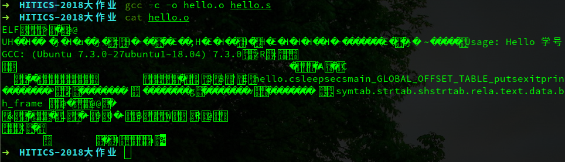

### <center>第四章 汇编</center>

#### 4.1 汇编的概念与作用

汇编，是将由ascii码存储的汇编文件，转化为二进制形式的可重定位目标文件的过程。通常，源文件是一个经过编译的.s文件。

按照平台的不同，CPU的指令集不同，生成的可重定位目标文件的内容也不同。汇编器根据各个平台的指令集逐条语句翻译为二进制的形式存储。同时将一些常量和全局变量插在目标文件的不同的节里。同时，汇编器还会将ELF文件的信息、机器类型等数据写入ELF头，方便后续操作。

#### 4.2 在Ubuntu下汇编的命令

汇编命令：

```shell
gcc -c -o hello.o hello.s
```

执行效果截图（由于hello.o是二进制形式存储，输出不可读）：



#### 4.3 可重定位目标elf格式

hello.o的ELF文件（也是通用的）由三个部分组成：

1. ELF头

   ELF头中包含有整个ELF文件的基本信息，包括Magic Number（魔数）

   版本、平台、程序入口以及各个部分（ELF头、程序头、节头）的大小。

2. 程序头

   告诉系统如何创建进程映像。用来构造进程映像的目标文件必须具有程序头部表，而可重定位目标文件则没有这个头。故显示“本文件中没有程序头。”。

3. 节头

   包含了描述文件节区的信息，每个节区在表中都有一项，每一项给出诸如节区名称、节区大小这类信息。可重定位目标文件必须包含节区头部表。

使用readelf -t hello.o即可显示各个节的详细信息，如下：

```
节头：
  [号] 名称              类型             地址              偏移量
       大小              全体大小          旗标   链接   信息   对齐
  [ 0]                   NULL             0000000000000000  00000000
       0000000000000000  0000000000000000           0     0     0
  [ 1] .text             PROGBITS         0000000000000000  00000040
       0000000000000081  0000000000000000  AX       0     0     1
  [ 2] .rela.text        RELA             0000000000000000  00000340
       00000000000000c0  0000000000000018   I      10     1     8
  [ 3] .data             PROGBITS         0000000000000000  000000c4
       0000000000000004  0000000000000000  WA       0     0     4
  [ 4] .bss              NOBITS           0000000000000000  000000c8
       0000000000000000  0000000000000000  WA       0     0     1
  [ 5] .rodata           PROGBITS         0000000000000000  000000c8
       000000000000002b  0000000000000000   A       0     0     1
  [ 6] .comment          PROGBITS         0000000000000000  000000f3
       000000000000002b  0000000000000001  MS       0     0     1
  [ 7] .note.GNU-stack   PROGBITS         0000000000000000  0000011e
       0000000000000000  0000000000000000           0     0     1
  [ 8] .eh_frame         PROGBITS         0000000000000000  00000120
       0000000000000038  0000000000000000   A       0     0     8
  [ 9] .rela.eh_frame    RELA             0000000000000000  00000400
       0000000000000018  0000000000000018   I      10     8     8
  [10] .symtab           SYMTAB           0000000000000000  00000158
       0000000000000198  0000000000000018          11     9     8
  [11] .strtab           STRTAB           0000000000000000  000002f0
       000000000000004d  0000000000000000           0     0     1
  [12] .shstrtab         STRTAB           0000000000000000  00000418
       0000000000000061  0000000000000000           0     0     1
```

重定位节.rela.text的信息如下：

```
重定位节 '.rela.text' at offset 0x340 contains 8 entries:
  偏移量          信息           类型           符号值        符号名称 + 加数
000000000018  000500000002 R_X86_64_PC32     0000000000000000 .rodata - 4
00000000001d  000c00000004 R_X86_64_PLT32    0000000000000000 puts - 4
000000000027  000d00000004 R_X86_64_PLT32    0000000000000000 exit - 4
000000000050  000500000002 R_X86_64_PC32     0000000000000000 .rodata + 1a
00000000005a  000e00000004 R_X86_64_PLT32    0000000000000000 printf - 4
000000000060  000900000002 R_X86_64_PC32     0000000000000000 sleepsecs - 4
000000000067  000f00000004 R_X86_64_PLT32    0000000000000000 sleep - 4
000000000076  001000000004 R_X86_64_PLT32    0000000000000000 getchar – 4
重定位节 '.rela.eh_frame' at offset 0x400 contains 1 entry:
  偏移量          信息           类型           符号值        符号名称 + 加数
000000000020  000200000002 R_X86_64_PC32     0000000000000000 .text + 0
```

.rela.text是.text节的重定位信息。其中，偏移量标识了重定位入口的偏移；信息字段表示重定位入口的类型和符号，其中低8位表示重定位入口的类型， 高24位表示重定位入口的符号在符号表中的下标；类型有两个宏定义，R_X86_64_32表示绝对地址修正（S+A），R_X86_64_PC32表示相对地址修正（S+A-P）。A为保存在被修正位置的值(例如printf重定位处的值是0x00 00 00 00)，P为被修正的位置(相对于段开始的偏移量或者虚拟地址)，S为符号的实际地址，即由信息字段的高24位指定的符号的实际地址。

#### 4.4 hello.o的结果解析

hello.o的反汇编是对hello.o的代码节（.text）的反汇编。其中，汇编器给main函数分配了虚拟地址0000000000000000。每一条语句前都有其对应的机器语言，且每一条语句都有自己相对于main函数的偏移量，跳转时即可通过这个偏移量快速跳转到对应代码处。机器语言由操作符和操作数构成，x86-64的操作符是两个16进制数，由操作数和操作符构成的指令码可以根据平台翻译为汇编语句。

在调用函数处，仅仅是call了一个相对偏移量，方便之后的链接器根据这个偏移量和重定位节将代码链接在一起，使用objdump -d -r hello.o得到的反汇编代码已经在每一个可重定位处结合重定位节将函数标示了出来。同样，在两个字符串常量和sleepsecs全局变量处，仅仅是标示着0x0(%rip)，在链接之后字符串处将指向.rodata区的某个地址，sleepsecs将指向.data区。

由于仅仅是.text节的反汇编，和hello.s不同的是，内容中没有了一些全局变量的声明和初始化，也没有了常量的声明。而且，hello.s在流程控制语句中进行跳转的时候，都是借助标签跳转，如jmp .L3。而在反汇编中的跳转则是直接借助相对于main函数的地址偏移量，如jmp 6f，则直接跳转到相对于main函数的地址偏移0x6f的指令处。

#### 4.5 本章小结

从汇编开始，程序开始变成二进制的形式，虽然不再用户友好，但是愈发地计算机友好。汇编后的程序开始将各个内容（代码，变量等）分节存储，向内存映像上靠拢。存储的重定位节为下一章的链接提供了指引。