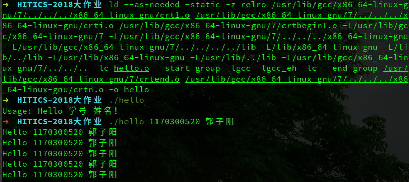

### <center>第五章 链接</center>

#### 5.1 链接的概念与作用

链接，是指将一个或多个由汇编器生成的二进制存储的可重定位目标文件外加库生成一个二进制的可执行目标文件的过程。

链接分为动态链接和静态链接，多数对于公有函数库的引用使用的都是动态链接，可以大大减小目标文件的大小。

可重定位目标文件中存在有一些未定义的符号，以及一些可重定位部分，链接就是解析未定义符号的引用，将目标文件中的占位符替换为符号的地址。链接还要完成程序中各目标文件的地址空间的组织，这就要涉及重定位工作。

#### 5.2 在Ubuntu下链接的命令

链接命令（由gcc -v得）：

```shell
ld --as-needed -static -z relro /usr/lib/gcc/x86_64-linux-gnu/7/../../../x86_64-linux-gnu/crt1.o /usr/lib/gcc/x86_64-linux-gnu/7/../../../x86_64-linux-gnu/crti.o /usr/lib/gcc/x86_64-linux-gnu/7/crtbeginT.o -L/usr/lib/gcc/x86_64-linux-gnu/7 -L/usr/lib/gcc/x86_64-linux-gnu/7/../../../x86_64-linux-gnu -L/usr/lib/gcc/x86_64-linux-gnu/7/../../../../lib -L/lib/x86_64-linux-gnu -L/lib/../lib -L/usr/lib/x86_64-linux-gnu -L/usr/lib/../lib -L/usr/lib/gcc/x86_64-linux-gnu/7/../../.. -lc hello.o --start-group -lgcc -lgcc_eh -lc --end-group /usr/lib/gcc/x86_64-linux-gnu/7/crtend.o /usr/lib/gcc/x86_64-linux-gnu/7/../../../x86_64-linux-gnu/crtn.o
```

执行效果截图：



#### 5.3 可执行目标文件hello的格式

hello的ELF文件（也是通用的）由三个部分组成：

1. ELF头

   ELF头中包含有整个ELF文件的基本信息，包括Magic Number（魔数）版本、平台、程序入口以及各个部分（ELF头、程序头、节头）的大小。

2. 程序头

   告诉系统如何创建进程映像。用来构造进程映像的目标文件必须具有程序头部表，其中可重定位目标文件没有这个头。

3. 节头

   包含了描述文件节区的信息，每个节区在表中都有一项，每一项给出诸如节区名称、节区大小这类信息。可重定位目标文件必须包含节区头部表。

使用readelf --segment hello即可显示各个段的详细信息，如下：

```
程序头：
  Type           Offset             VirtAddr           PhysAddr
                 FileSiz            MemSiz              Flags  Align
  LOAD           0x0000000000000000 0x0000000000400000 0x0000000000400000
                 0x00000000000b5ddd 0x00000000000b5ddd  R E    0x200000
  LOAD           0x00000000000b6120 0x00000000006b6120 0x00000000006b6120
                 0x00000000000051b8 0x00000000000068e0  RW     0x200000
  NOTE           0x0000000000000190 0x0000000000400190 0x0000000000400190
                 0x0000000000000020 0x0000000000000020  R      0x4
  TLS            0x00000000000b6120 0x00000000006b6120 0x00000000006b6120
                 0x0000000000000020 0x0000000000000060  R      0x8
  GNU_STACK      0x0000000000000000 0x0000000000000000 0x0000000000000000
                 0x0000000000000000 0x0000000000000000  RW     0x10
  GNU_RELRO      0x00000000000b6120 0x00000000006b6120 0x00000000006b6120
                 0x0000000000002ee0 0x0000000000002ee0  R      0x1

 Section to Segment mapping:
  段节...
   00     .note.ABI-tag .rela.plt .init .plt .text __libc_freeres_fn __libc_thread_freeres_fn .fini .rodata .stapsdt.base .eh_frame .gcc_except_table 
   01     .tdata .init_array .fini_array .data.rel.ro .got .got.plt .data __libc_subfreeres __libc_IO_vtables __libc_atexit __libc_thread_subfreeres .bss __libc_freeres_ptrs 
   02     .note.ABI-tag 
   03     .tdata .tbss 
   04     
   05     .tdata .init_array .fini_array .data.rel.ro .got
```

程序头中描述了各段的详细信息。其中，Type字段表示该内存段的类型；Offset指明该段中内容在文件中的位置，即该段起始位置相对于文件开头的偏移量；VirtAddr指明该段的起始位置在进程地址空间中的虚拟地址；PhysAddr表明该段的起始位置在进程地址空间的物理地址（对于大多数现代操作系统，物理地址不可预先得到，该字段大多数情况下保留不用或改为它用）；FileSiz字段指明该段在内存镜像的大小（字节）；MemSiz字段表明该段在内存镜像中的大小（字节）；Flags指明该段内容的属性（R：可读，W：可写，X：可执行）；Align字段表明该段内容如何在内存中和文件对齐。

段节的数据指明了各段（Segment）包含了哪些节（Section）。

#### 5.4 hello的虚拟地址空间

使用readelf指令查看虚拟空间各段的信息，其中程序头部分描述了各段信息，程序头的一条描述一个段。如下：

```
程序头：
  Type           Offset             VirtAddr           PhysAddr
                 FileSiz            MemSiz              Flags  Align
  LOAD           0x0000000000000000 0x0000000000400000 0x0000000000400000
                 0x00000000000b5ddd 0x00000000000b5ddd  R E    0x200000
  LOAD           0x00000000000b6120 0x00000000006b6120 0x00000000006b6120
                 0x00000000000051b8 0x00000000000068e0  RW     0x200000
  NOTE           0x0000000000000190 0x0000000000400190 0x0000000000400190
                 0x0000000000000020 0x0000000000000020  R      0x4
  TLS            0x00000000000b6120 0x00000000006b6120 0x00000000006b6120
                 0x0000000000000020 0x0000000000000060  R      0x8
  GNU_STACK      0x0000000000000000 0x0000000000000000 0x0000000000000000
                 0x0000000000000000 0x0000000000000000  RW     0x10
  GNU_RELRO      0x00000000000b6120 0x00000000006b6120 0x00000000006b6120
                 0x0000000000002ee0 0x0000000000002ee0  R      0x1
```

Type字段表示该内存段的类型；Offset指明该段中内容在文件中的位置，即该段起始位置相对于文件开头的偏移量；VirtAddr指明该段的起始位置在进程地址空间中的虚拟地址；PhysAddr表明该段的起始位置在进程地址空间的物理地址（对于大多数现代操作系统，物理地址不可预先得到，该字段大多数情况下保留不用或改为它用）；FileSiz字段指明该段在内存镜像的大小（字节）；MemSiz字段表明该段在内存镜像中的大小（字节）；Flags指明该段内容的属性（R：可读，W：可写，X：可执行）；Align字段表明该段内容如何在内存中和文件对齐。

通常，一个段包含一个或多个节，每个段包含的节信息在下面的section to segment mapping部分给出。

```
Section to Segment mapping:
  段节...
   00     .note.ABI-tag .rela.plt .init .plt .text __libc_freeres_fn __libc_thread_freeres_fn .fini .rodata .stapsdt.base .eh_frame .gcc_except_table 
  01     .tdata .init_array .fini_array .data.rel.ro .got .got.plt .data __libc_subfreeres __libc_IO_vtables __libc_atexit __libc_thread_subfreeres .bss __libc_freeres_ptrs 
   02     .note.ABI-tag 
   03     .tdata .tbss 
   04     
   05     .tdata .init_array .fini_array .data.rel.ro .got
```

#### 5.5 链接的重定位过程分析

在链接时，链接器将对.text段和.data段进行重新划分，将多个可重定位目标文件的两个段结合，在hello.o的反汇编中，可以看到只有一个main函数，而在hello的反汇编中，除去main以外还有多个如_start等函数，这些函数来自其它的可重定位目标文件。

在可重定位目标文件hello.o中，main函数的地址是0000000000000000，其实是未分配地址的，而在hello的反汇编中，main函数被分配给地址000000000048a370，这是main函数在真正运行时相对于整个.text段的偏移。链接器将各个段组合在一起后确定了各个段以及函数的最终地址（虚拟地址）。

在可重定位目标文件hello.o的反汇编中，字符串常量或者变量（已初始化）仅仅是使用0x0(%rip)来暂时表示其位置（占位），这并不是其最终的地址（因为所有的常量和变量都是这个地址）。而在可执行目标文件hello的反汇编中，这些符号都被分配了一个确定的地址（虚拟地址），链接器根据各个可重定位目标文件的重定位节给每个符号分配了最终的地址。

#### 5.6 hello的执行流程

执行hello，程序入口（第一个被执行的函数）是\_start()函数，\_start()函数做一些准备工作（注册必要函数），调用\_\_libc_start_main()函数首先调用\_\_libc_csu_init()函数，该函数调用\_init()函数初始化main()函数的运行环境，之后\_\_libc_start_main()函数调用main()函数。在main()函数结束后，将返回\_\_libc_start_main()函数，并调用\_\_libc_csu_fini()，该函数调用_fini()函数，做一些资源的回收工作。

主要函数名与地址：

| 函数名            | 地址             |
| ----------------- | ---------------- |
| _start            | 0000000000400a10 |
| __libc_start_main | 0000000000400da0 |
| __libc_csu_init   | 0000000000401800 |
| _init             | 00000000004003d8 |
| main              | 000000000048a370 |
| __libc_csu_fini   | 00000000004018a0 |
| _fini             | 00000000004924b0 |

#### 5.7 Hello的动态链接分析

使用动态链接生成的可执行目标文件，启动时不会调用ELF头中指定的程序入口函数，而是会首先执行动态链接器。动态链接器是一个可执行目标程序，它与可重定位目标文件的链接过程是静态的。由于动态链接器的入口代码即使自举代码（自己编译自己），于是动态链接器的自举代码会首先开始运行。自举代码首先找到动态链接器的.dynamic段，通过“.dynamic”中的信息，自举代码便可以获得动态链接器本身的重定位表和符号表等，从而得到动态链接器本身的重定位入口，先将它们全部重定位。从这一步开始，动态链接器代码中才可以开始使用自己的全局变量和静态变量。

动态链接器将可执行文件和链接器本身的符号表都合并到一个符号表当中，我们可以称它为全局符号表（Global Symbol Table）。然后链接器开始寻找可执行文件所依赖的共享对象，“.dynamic”段中，有一种类型的入口是DT_NEEDED，它所指出的是该可执行文件（或共享对象）所依赖的共享对象。由此，链接器可以列出可执行文件所需要的所有共享对象，并将这些共享对象的名字放入到一个装载集合中。然后链接器开始从集合里取一个所需要的共享对象的名字，找到相应的文件后打开该文件，读取相应的ELF文件头和“.dynamic”段，然后将它相应的代码段和数据段映射到进程空间中。如果这个ELF共享对象还依赖于其他共享对象，那么将所依赖的共享对象的名字放到装载集合中。如此循环直到所有依赖的共享对象都被装载进来为止，

当一个新的共享对象被装载进来的时候，它的符号表会被合并到全局符号表中，所以当所有的共享对象都被装载进来的时候，全局符号表里面将包含进程中所有的动态链接所需要的符号。

当所有共享对象加载完毕之后，动态链接器将退出，同时执行ELF头中指定的程序入口。

#### 5.8 本章小结

链接是生成一个可执行文件的最后一步，它将各个模块整合在一起。这种模块化的整合模式使得模块化编程称为可能。链接器将各个目标文件的各个段分割合并，并确定了每个符号的实际意义与地址。静态链接在程序执行前就完成了所有的工作，而动态链接则是在程序运行的时候才进行链接。至此，一个C语言文本真正称为了一个可执行文件。