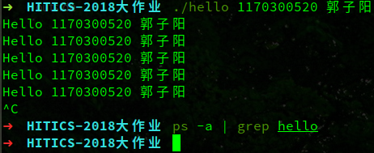
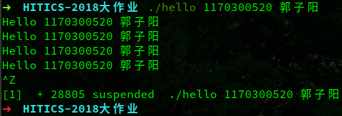
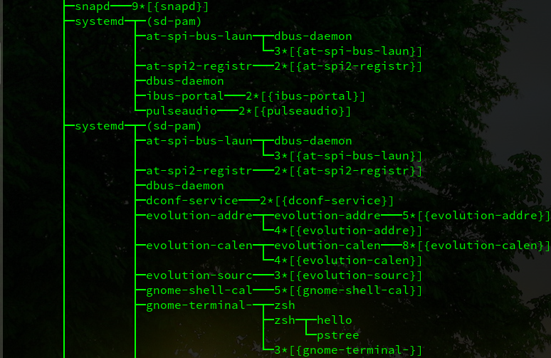
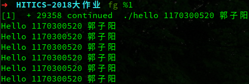
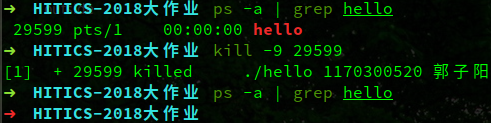

### 
第六章 hello进程管理

#### 6.1 进程的概念与作用

进程，是计算机中的程序关于某数据集合上的一次运行活动，是程序（指令和数据）的真正的运行实例，是系统进行资源分配和调度的基本单位，是操作系统结构的基础。在当代面向线程设计的计算机结构中，进程是一组相关线程的容器。

进程给每个应用提供了两个抽象：逻辑控制流和私有地址空间。逻辑控制流通过上下文切换让分时处理各个进程，私有地址空间则是通过虚拟内存机制让每个程序仿佛在独占物理内存空间。这样的抽象保证了在不同的情况下运行同样的程序可以得到相同的结果，使得具体的应用不需要关心关心处理器和内存的相关事宜。

#### 6.2 简述壳Shell-bash的作用与处理流程

shell，俗称“壳”（区别于操作系统的内“核”），本质上是一个C语言编写的程序，是用户与linux/unix交互的桥梁，是一个为用户提供操作界面的软件。Linux的shell是一个可以解析用户指令并执行相应操作的C程序。Linux的shell使用较多的有sh、bash和zsh。

Linux下的shell执行的简易流程：

1. 读取输入的命令。
2. 分割命令为各个单词，各个单词成为token。
3. 检查第一个token是否是shell的内置命令，如果是则直接调用运行。
4. 如果不是内置命令，则按照第一个token的路径查找可执行文件，并将其它token作为参数运行。
5. 如果最后一个token不是“&”，则该条命令在前台运行，shell将会阻塞等待程序终止或停止，并输出程序的输出。如果最后一个是“&”，则执行后shell将不会阻塞，直接进入等待下一条命令输入的状态。

#### 6.3 hello的fork进程创建过程

在收到执行hello的命令后，shell调用fork函数创建了一个新的进程。调用fork函数的shell进程就是父进程，产生的新进程称为子进程。并且fork函数从两个进程中分别返回，父进程中返回的是子进程的进程id，子进程中返回的是0。接着两个进程互不干扰地继续执行。

在早期的Linux系统中，fork一个进程是将该进程的所有内存复制产生一个新的内存映像。由于这种方式比较浪费内存，在现在的操作系统中，fork刚执行后并不会直接复制父进程的所有内存，子进程的代码段、数据段、堆栈都暂时指向父进程的页表，即两个的虚拟空间不同，但是物理空间是同一个。当父进程或子进程有修改段段行为发生时，再为子进程的段分配空间，直到子进程执行exec函数之前，代码段都是和父进程共享的。执行exec函数后，子进程和父进程就拥有了完全分离的两个物理空间，子进程独立地执行新的代码段。这种技术被称为写时复制技术。

#### 6.4 hello的execve过程

被fork出的子进程执行execve函数，进程陷入内核模式，用以访问hello的可执行目标文件。进程先执行一些必要的安全检查，读取hello开头的128个字节的ELF头（X86架构的Linux）以获取该程序的基本信息，接着将可执行文件映射到当前进程的进程空间中，并覆盖掉原来的进程数据，由于之前与当前进程的父进程共享代码段，此时就会在物理内存中为代码段分配空间。进程将EIP段值设置为新的可执行程序的入口地址，如果可执行程序是静态链接的程序，或不需要其他的动态链接库，则新的入口地址就是新的可执行文件的main函数地址；如果可执行程序还需要其他的动态链接库，则入口地址是链接器ld的入口地址。最后返回用户模式，CPU从新的EIP的地址中取指执行，即hello开始执行。至此，老进程的上下文已经完全被新的进程替代，但依然保有原来的进程ID。

#### 6.5 hello的进程执行

进程时间片是为了进行进程调度而产生的概念。每个进程被分配给一个时间段，成为其时间片，也就是该进程允许运行的时间，如果在属于该进程的时间片结束时该进程依然在运行，则CPU将被剥夺并分配给另一个进程，如果进程在时间片结束前阻塞或结束，则CPU立刻进行切换。而进程调度所需要做的，仅仅是维护一个进程时间片队列，当一个进程用完其时间片后，它的时间片将被移到队列尾。当hello开始执行一段时间后，其时间片结束，CPU将切换到另一个进程运行。为了在切换回该进程时能够接着上次运行的地方继续运行，内核需要保存进程的一些寄存器的值、堆栈等，这些组成了进程的进程上下文。进程的切换实质上是进程上下文的切换。就这样hello与其它进程交替执行，交替占用CPU，直到hello进程结束。

一般来说，一个进程可以在两种状态下执行，用户模式（用户态）和内核模式（内核态），内核模式的权限高于用户模式的权限。进程每次调用一个系统调用时，进程的运行方式都发生变化：从用户模式切换到内核模式，然后继续执行。当出现系统调用或者发生异常（异常处理程序）时，进程就会从用户态切换回内核态。如果一个进程进入内核模式，那么那个进程就不会被进程调度切换，而会一直占有CPU，直到该进程终止或退出内核模式准备进入用户模式。

进程hello可能会由于用户按下ctrl+z或者ctrl+c向进程发送信号进入内核模式，或者出现缺页异常而进入内核模式，启动异常处理程序，如果是ctrl+z引发异常，异常处理程序将挂起（停止）hello进程，接着进行进程调度切换至其它进程。如果是ctrl+c，异常处理程序将直接终止进程。如果产生缺页异常，异常处理程序将进行系统调用，在磁盘（固态硬盘）上读取相应的虚拟页，并将其装入内存，在从内核模式退出时，将进行系统进程调度，切换到其它进程，当再次切换回hello时，将从上次导致缺页异常的地方再次执行，这次则不会引发缺页异常，进程正常地执行下去。

#### 6.6 hello的异常与信号处理

在hello执行的时候按下ctrl+c，截图如下：

按下ctrl+c后，使用ps命令可以看出，hello进程已完全终止。

当用户按下ctrl+c后，shell进程通过内核向hello进程发送SIGINT信号，hello进程捕获到了这个信号后，陷入内核模式，由于没有指定信号处理程序，进程将启动默认的处理程序，处理程序执行默认动作，终止hello进程。

在hello执行的时候按下ctrl+z，截图如下：

显示出进程hello已经被停止，进程id为28805。当用户按下ctrl+z后，内核向进程发送SIGTSTP信号，该信号的默认动作是将当前运行在前台的进程挂起（停止）。

此时使用命令ps -a | grep hello，显示如下：

显示出进程id，hello进程名标红表示该进程已停止。

输入命令jobs -l，其中-l表示显示作业的进程id，显示如下：

该命令表示显示后台的所有工作，可以看到当前后台仅有一个工作hello，且suspended表示停止（挂起）状态。“+”表示这是最近一个放入后台的工作。

pstree命令可以以树状图的形式显示进程间的关系，由于进程树过大，只能截取部分：

可以看到，hello进程的从属关系为：

system => system => gnome-terminal => zsh => hello

其中，system是所有进程的祖先进程。

使用fg命令加上作业id，可以将该进程转为前台进程并继续执行，输入fg %1，如下：

作业继续执行（continued）。

在进程挂起（suspended）时，使用kill命令，给进程发送信号9，可终止目标进程，如下：

显示进程已被终止（killed），再使用ps命令时则查看不到该进程，说明该进程确实以终止。kill -9 \<pid>命令向进程发送信号9，即SIGKILL，该信号的默认处理动作是直接终止进程。

 

hello进程执行时还可能引发缺页异常，该异常是由虚拟地址所在的虚拟页映射的物理页没有在内存中分配导致的。当发生这个异常时，进程将陷入内核模式，启动缺页异常的对应处理程序。内核将找到引发异常的虚拟页，并将其写入物理内存中，并退出处理程序。进程将再次执行上次发生缺页异常的代码。

​       

**异常与信号处理：**

**当进程发生异常时，会陷入内核模式，如果没有事先设定好处理程序的话，执行对应的默认异常处理程序，进行默认处理动作，从处理程序返回后，进程有可能接着运行，也有可能重新运行导致异常产生的代码，也有可能终止或挂起。由于信号属于中断，是一种异常，所以处理的过程相似。**

#### 6.7 本章小结

进程的概念是当代计算机最重要的概念之一，它使多任务同时运行成为可能。每一个进程都如同独占CPU和内存一般，保证了运行的连贯性和结果一致性。异常和信号机制使我们可以灵活地调度协调各个各个进程。