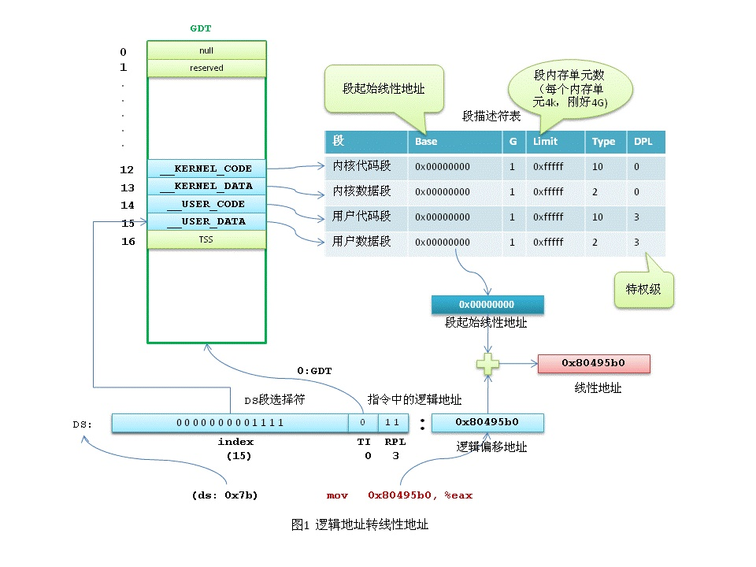
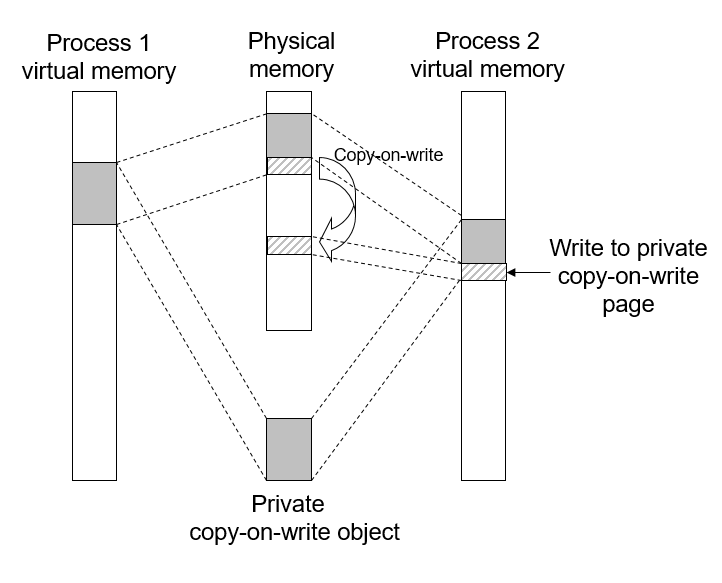

### <center>第七章 hello的存储管理</center>

#### 7.1 hello的存储器地址空间

逻辑地址，是指由程序产生的和段相关的偏移地址，这个地址是相对于进程数据段的地址，与物理内存和物理地址无关。汇编语言中出现的地址操作中的地址就是逻辑地址，表示地址所代表的位置相对于段开头的偏移。一个逻辑地址由一个段标识符加上一个指定段内相对地址的偏移量组成，表示为 [段标识符：段内偏移量]。通常，在汇编语言中，段内偏移量部分恰好和该地址对应的虚拟地址相同。逻辑地址反映的是硬件平台段式管理的结果，是硬件平台段式管理转换前的地址。

举hello的反汇编代码中的一条操作为例：

```assembly
mov    0x200842(%rip),%eax
```

该条操作有一个相对寻址，寻到的地址为寄存器%rip中的地址加上0x200842的结果，这个结果就是其逻辑地址的段内偏移量。

线性地址，与逻辑地址的概念类似，都是一个虚拟的、不真实的地址（与物理地址的概念相对）。逻辑地址是对应的硬件平台段式管理转换前的地址，那么线性地址则对应了硬件页式内存的转换前的地址。线性地址是逻辑地址的段偏移地址加上该段的基地址（段标识符表示的段的开头地址）得到的。线性地址又被称为虚拟地址。

物理地址，就是数据真实地在物理内存中存储的地址，只有在程序运行时才会分配，同一个进程多次运行，物理地址空间都可能不同，由操作系统调度决定。

#### 7.2 Intel逻辑地址到线性地址的变换-段式管理

汇编语言中出现的地址，都是逻辑地址（为了向下兼容），需要转换成线性地址，再经过MMU转换成物理地址才可以访问。

如上面那个例子：

```assembly
mov    0x200842(%rip),%eax
```

设x为0x200842加上%rip中的地址值。那么x就是一个逻辑地址的段偏移量，代表着数据的段偏移量，我们需要找到该段的基地址，相加即可得到线性地址。在x86保护模式下，段的信息（段基地址、长度、权限等）即段描述符占8个字节，段信息无法直接存放在段寄存器中（段寄存器只有2字节）。Intel的设计是段描述符集中存放在GDT（全局段描述符表）或LDT（局部段描述符表）中。逻辑地址是由段标识符和段内偏移量组成，其中段内标识符是一个16位长的字段，前13位表示段索引号，后3位是一些硬件信息。硬件信息中有一位TI，决定了对应的段描述符是在GDT还是在LDT中。根据TI和段索引号，操作系统在对应的段描述符表中即可找到对应的段描述符，取出段的基地址，与段偏移量相加即得到对应的线性地址。如下图：



在Linux中，逻辑地址等于线性地址，Linux所有的段（用户代码段、用户数据段、内核代码段、内核数据段）的线性地址都是从0x00000000 开始。Linux通过这种方式运行在分段的x86上，却绕开了分段管理，进行分页的内存管理。

#### 7.3 Hello的线性地址到物理地址的变换-页式管理

CPU通过MMU（内存管理单元）将线性地址转换为物理地址，即可通过物理地址向物理内存取出数据。

分页是CPU提供的内存管理的机制，Linux利用这种机制实现了内存管理。控制寄存器CR0的最高位PG位决定着分页机制是否有效，如果PG为1，则分页机制有效，需要经过页表查找来将线性地址转换为物理地址，如果PG为0，分页机制无效，线性地址可直接作为物理地址使用。

分页的基本原理是将内存划分为若干相同大小的单元，每个单元称为一页，每一页包含4K字节的地址空间。为了转换为物理地址，CPU需要一个线性地址转换为物理地址的查找表，即页表。为了简化处理，使用二级页表。在这种分页管理机制当中，第一级页表被称为页目录表，用于存放每个页表的基地址，第二级页表才存储着各个页的基地址。由于每一个进程都有独立的虚拟内存，那么每一个进程都有一个与之对应的页目录表，这个页目录表的基地址存储在CPU的寄存器CR3中，在进行进程调度的时候，由操作系统负责将该寄存器的值修改为当前进程的页目录表的基地址。

在x86架构中，每一条线性地址是32位，分成三部分：前10位是页目录索引，中间10位是页表索引，最后12位是偏移量。

当CPU获得一个线性地址时，它会从CR3中取得进程的页目录地址，取出其前20位，得到进程的页目录基地址。根据取出来的页目录的基地址以及线性地址的前十位，进行组合得到线性地址的前十位的索引对应的项在页目录中地址，根据该地址可以取到该地址上的值，该值就是二级页表项的基址。根据二级页表项的基地址，结合线性地址的中间10位页表索引，可以获得线性地址对应的物理页在内存中的地址在二级页表中的地址。根据这个地址即可获得物理页在内存中的基地址，在根据线性地址的最后12位偏移量得到具体的物理地址。

#### 7.4 TLB与四级页表支持下的VA到PA的变换

TLB，即翻译后备缓冲器，是一个MMU中关于页表项（PTE）的小的缓存，这是一个组相连缓存。当存在TLB时，虚拟地址的虚拟页号（VPN）被分割称为两个部分：TLB标记（TLBT）和TLB索引（TLBI）。在CPU取得一个虚拟地址时， MMU对进行翻译。MMU根据TLBI获得TLB中对应的组，并查找组内是否有标记和TLBT相同的行，如果存在，则TLB命中，MMU从中取出PTE，获取物理页在内存中的基地址，加上虚拟地址的最后12位偏移（VPO）得到具体的物理地址。如果TLB未命中（PTE不在TLB中），MMU将逐级查找PTE。四级页表下，只有第一级页表（页目录表）将常驻主存，其他三级页表将在需要时装入主存。四级页表下，虚拟地址中的VPN被划分成四个部分，分别对应着不同级别的页表的偏移量。CPU首先从CR3中取出第一级页表（页目录表）的基地址，以VPN1为偏移量在第一级页表中即可查找出第二级页表的基地址。如此一级一级查找，最后以VPN4为偏移量从第四级页表中取得PTE，将该PTE返回给CPU，MMU将该PTE存入TLB中（必要时驱逐）后，从PTE解析出物理页的基地址，加上虚拟地址的偏移量（VPO）得到最后的物理地址。

#### 7.5 三级Cache支持下的物理内存访问

CPU的三级Cache都是组相连高速缓存，上一级是下一级的缓存，第三级是内存的缓存。每一级缓存是由多个组组成，一个组内有多个行，一个行由有效位（指示该行是否有效）、标记位（行的唯一标记）和高速缓存块（数据）组成。

当CPU获得一个物理地址时，将该物理地址分为三个部分：标记、组索引和块偏移，CPU按照组索引在第一级Cache查找到相应的组，遍历组内的行查找是否有标记和地址的标记相同且有效的行，如果存在则一级缓存命中，按照块偏移量从该行的高速缓存块中取出数据块。如果一级缓存不命中，则回去二级缓存中查找是否有标记和地址的标记相同且有效的行，如果存在则二级缓存命中，将该缓存行写回一级缓存中（必要时驱逐），并从一级缓存中的行中的高速缓存块中取得数据块。如果二级缓存不命中，三级缓存查找同理。如果三级缓存命中，则将缓存行逐级写回二级缓存和一级缓存（必要时驱逐），最后一级缓存中取数据块（所有的情况都是从一级缓存中取数据块）。如果三级缓存不命中，则会从内存中按照地址查找到数据，获取出一整个行大小的数据，构建成缓存行写入三级缓存，并逐级写回，最后从一级缓存中取出数据块。

#### 7.6 hello进程fork时的内存映射

内存映射，是指一个虚拟内存空间和一个磁盘上的对象之间的映射关系。内存映射分为两种：文件映射和匿名映射，文件映射将一个普通文件的全部或者一部分映射到进程的虚拟内存中，映射后，进程就可以直接在对应的内存区域操作文件内容；匿名映射没有对应的文件或者对应的文件时虚拟文件，映射后会把内存分页全部初始化为0。如果多个进程都会同一个内存区域操作时，会根据映射的特性，会有不同的行为。

内核调用fork函数时主要涉及的内存映射主要是虚拟地址空间到物理地址空间的映射。当多个进程映射了同一个内存区域时，它们会共享物理内存的相同分页。根据映射特征可分为私有映射和共享映射：私有映射的映射的内容对其他进程不可见，而共享映射中某一个进程对共享的内存区域操作都对其他进程可见。

当一个进程调用fork函数创建新的子进程时，内核在虚拟内存上分配一个空间，并且完全复制父进程的映射，即子进程和父进程的虚拟地址空间都映射到了同一个物理地址空间。然而，两个进程的每个区域结构都标记为私有的。这样，在父进程或者子进程在对内存数据进行修改时，会涉及一个技术：写时复制技术（copy-on-write）。当子进程或者父进程对页进行修改时，子进程就会在物理内存上创建新的页，并映射虚拟内存上的对应页到新的物理页，这样就可以保证子进程和父进程的地址空间私有。



#### 7.7 hello进程execve时的内存映射

当一个进程调用execve函数后（刚调用fork），由于需要放弃继承自父进程的物理地址空间，使用独有的物理地址空间，内核将这部分与父进程共享的物理内存对应的虚拟内存取消映射，并将该部分虚拟内存释放掉。

接着内核读取hello的ELF头，按照节头信息将各个节装入虚拟内存中（需要时分配空间）。在物理内存中分配一个区域，将虚拟内存中进程的代码段和数据段映射到新分配的区域（真正的将代码和数据装入物理内存是在缺页时），并将映射标记为私有映射。

#### 7.8 缺页故障与缺页中断处理

缺页故障，即缺页中断，出现的原因是虚拟地址空间的页不必常驻物理内存。在执行一条指令时，如果内核发现要访问的页不在物理内存中（有效位为0），则停止该命令的执行，产生一个物理页不存在的异常，即缺页异常。缺页异常的处理程序可以通过从虚拟内存（磁盘上）中装载虚拟页到物理内存中的方式解决异常，处理程序返回后，进程将再次执行引发异常的指令，此次由于页已经位于物理内存中，指令将顺利执行，不发生异常。

造成缺页中断可能有以下几种情况：

1. MMU未创建虚拟页和物理页的映射关系，且该虚拟地址不在当前进程的线性区（虚拟地址空间）；
2. MMU未创建虚拟页和物理页的映射关系，但该虚拟地址在当前进程的线性区；
3. 请求读或写与该页的读写保护权限不一致；
4. 使用malloc或mmap后，内核没有给虚拟页创建物理页，读写该页都会发生缺页异常；
5. 使用fork创建新进程时，父子进程的虚拟页都映射到同一个物理页，且物理页为只读，当父子进程都页进行写操作时，会造成缺页异常（类似情况3）；
6. 被访问的页是脏页（物理页面已被修改但没有写回虚拟页面）会造成缺页异常。

造成缺页中断后，内核陷入内核模式，调用异常处理程序，异常处理程序对上述情况进行排查处理。

若出现情况1，可以肯定是一个编码错误，内核将向进程发送一个SIGKILL信号，强行终止该进程。情况2可能是由栈溢出导致的缺页中断，内核向进程发送一个SIGSEGV信号，进程收到该信号后按照段错误（segment fault）进行处理。情况3读写权限不一致，内核向进程发送一个SIGKILL信号（因为访问了一个被保护的区域），强行终止进程。情况4说明地址有效且没有保护权限问题，系统将检查物理内存中是否有空闲的页，如果有空闲页，就会执行系统调用，将虚拟内存上的页写入物理内存，此时内核将暂时挂起该进程，调度其它进程直到写入操作完成，操作完成后，调度执行该进程，将EIP指向造成缺页异常的指令并重新执行，此时将正常执行；如果没有空闲页，将按照一定的策略驱逐一个物理页并进程同样的流程。情况5发生在fork之后，当父子进程对页进程写操作时，内核会执行写时复制，将被写的物理页复制一份，并将子进程的虚拟页映射到新的物理页，并再次执行出现异常的语句。情况6访问脏页，则将该页面写回磁盘（虚拟内存），内核挂起造成异常的进程调度到其它进程，直到写回结束，并且将被写回的物理页标记为不可驱逐，避免被其它进程替换。待写回完成后，再次执行造成异常的指令。

#### 7.9动态存储分配管理

在操作系统中，内存管理主要以以下三种方式存在：静态存储区的内存管理、栈上的内存管理、堆上的内存管理。静态存储区大小在进程运行时不会改变，也不会重新分配，栈上的内存由操作系统负责分配和释放，而堆上的内存管理，又称为动态内存管理，程序在运行时通过malloc申请内存，这部分内存存在于堆上，生命周期由程序自己掌控：何时分配和何时释放（free）。

C语言中的malloc和free对动态内存进行分配和释放，这里的分配和释放是基于虚拟内存的，真正的物理内存的分配和释放由操作系统进行调度（缺页）。

malloc进行内存分配时，分不同情况调用两个函数：brk和mmap：当进程所需要分配的内存较大时（大于1M），malloc会使用mmap以页为单位（4K）分配内存；当所需的内存较小时，会使用brk在进程的堆上分配内存，一般来说，从堆分配出来的内存空间，系统一般不会回收，只有当进程的堆大小到达最大限额时或者没有足够连续大小的空间来为进程继续分配所需内存时，才会回收不用的堆内存。malloc使用brk分配内存才属于动态内存分配。

操作系统维护着一个堆上可用内存块的链表，称为空闲链表。当进程调用brk时，将沿着空闲链表找到一个足够大（大于等于所需空间）的内存块，并将其一分为二，一块大小与用户请求的大小相等，另一块大小就是空闲块剩下的字节，然后将分配给进程的那块返回，将剩下的那块链到空闲链表上。

由于多次分配，可能将堆划分为许多小块的空闲内存块，当进程请求一个较大的内存块时，可能空闲链上已经没有足够大的空闲块。这时，malloc请求延时，内核将对堆上的内存进行必要的整理，将相邻的两个较小的空闲块合成较大的空闲块，之后再次进行查找，分割并返回合适的内存块。如果依旧没有足够大的内存块时，内核将对不使用的对内存进行主动回收。

当进程调用free时，将用户释放的内存块标记为空闲，并且将其链到空闲链上，并合并相邻的（前后）空闲块为一整个空闲块。

通常，释放内存会使用两种不同的策略：LIFO（后进先出）法和地址顺序法。LIFO法将新释放的块直接放置在空闲链表的开始处，这样做的好处是较为简单，但是会造成较多的碎片内存。通常，我们使用地址顺序法，按照地址的大小将新的空闲块插入空闲链表，虽然需要遍历，但是可以大大减小碎片内存的产生。

#### 7.10本章小结

进程的顺利运行，需要多方面的配合：CPU、内存、硬盘、操作系统……软硬件间的协调调度保证了进程的执行。缓存机制加速了进程的运行，使CPU几乎不需要和缓慢的存储打交道，用最快的速度取出想要的数据。虚拟内存和CPU分时机制，使进程仿佛独占了所有的资源。虚拟地址和物理地址的分配转换，保证了每个进程结构的一致性。